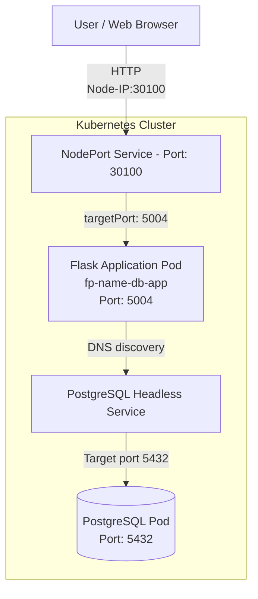

Author: Behrouz ShakeriFard <br>
Contact: bshakeri@torontomu.ca <br>
Date: November 8th, 2025

UPDATED
second iteration: July 2026


This is a sample web-based application designed for demonstrating deployment of a statefulset app on kubernetes.
Microservices: flask (front-end) + PostgreSQL (back-end)

ARCHITECTURE:



<hr>

Data is retrieved from a CSV file, and initialized via a simple init.sql script.

There are two services: 
Headless service for the PostgreSQL stateful - port 5432, 
NodePort service for flask - port 5004.

<hr>

Kubernetes manifest files: 

- flask deployment,
- flask Nodeport service,
- PV (persistent volume),
- NameSpace
- PostgreSQL statefulset,
- PostgreSQL Headless service,
- PostgreSQL PVC 
- ConfigMap and Secret, for allowing flask to access the database.

<hr>

<h3> 
App info: </h3>

NameSpace: name-db-lab
<br>
App-name: fp-name-db-app
<br>
Flask port: 5004
<br>
NodePort service: 30100
<br>

PostgreSQL port: 5432
<br>
PostgreSQL Headless Service Name: name-postgres-service
<br>

The connection between the Flask pod and the data-base pod (PostgreSQL) needs the included ConfigMap and Secret objects. These yaml manifests include the following information: service name or DB_HOST, DB name, DB username, DB Password.

<hr>

<h3> But I don't have the image! </h3>

You can use the included "Dockerfile".

Here is the content:

```bash
FROM python:3.12-alpine
WORKDIR /app

RUN pip install --no-cache-dir flask==3.0.3 pandas==2.2.3 psycopg2-binary

COPY app.py .
COPY templates/ templates/
COPY static/ static/

EXPOSE 5004

CMD ["python" , "app.py"]
```

What it does: it uses python 3.12 alpine as the base image; adds the necessary packages; and runs the "app.py".

```bash
docker build -t name-db-2026-07:v3 -f Dockerfile .
```
That's it!

<hr>

<h3> But the Pod fails because the image is not available! </h3>

Halelujah! 
That's very observant of you; Genius! :-D <br>

We have a solution :-D

```bash 
docker save name-db-2026-07:v3 -o name-db-2026-07-v3.tar
```

Now, you may import the image which you just saved, as a file.

```bash
sudo k3s ctr images import name-db-2026-07-v3.tar
```

Verify:

```bash
sudo k3s crictl images
```

And all is well :-D

```bash
kubectl apply -f flask-deployment.yaml
```

<hr>

<h3> Hnag on, I made a mistake, and I need to build and import the image again! </h3>

Wonderful! Not a problem. Delete the image from your cluster, like this:

```bash
sudo k3s crictl rmi docker.io/library/name-db-2026-07:v3
```

Cool.

By this time, you should see errors related to ConfigMap and Secret.<br> You guessed right! you should apply them as well.

```bash
kubectl apply -f flask-ConfigMap.yaml
kubectl apply -f flask-Secrets.yaml 
```

<hr>

<h3> But I can't see anything on my browser! </h3>

Excellent; and you shouldn't! You know why?

Because of some trivial small object called <b>NodePort service</b>.

```bash
kubectl apply -f flask-service-nodeport.yaml
```

Now, you have a service (a networking object) which should allow you to see your app on your browser. But don't get excited yet. We have things to do!

```bash
kubectl get svc -n name-db-lab
```

Look at the five digit number: 30100 <br>
That is your nodeport.

```bash
kubectl get nodes -o wide
```

Now, look at the IP. It should be something like 192.168.1.17
<br> Open your browser, and type:

```bash
192.168.1.17:30100
```

Now you should see your web-app :-D

<hr>

<h3> But it says "Error: could not translate host name "name-postgres-service" </h3>

Yeah.. I know! <br>
End of the world? Not quite! We can fix this. <br>
You need the postgres pod; don't you? :-D

```bash
kubectl apply -f postgres-statefulset.yaml
```

Don't do it yet! You need a PV and a PVC before you do this!