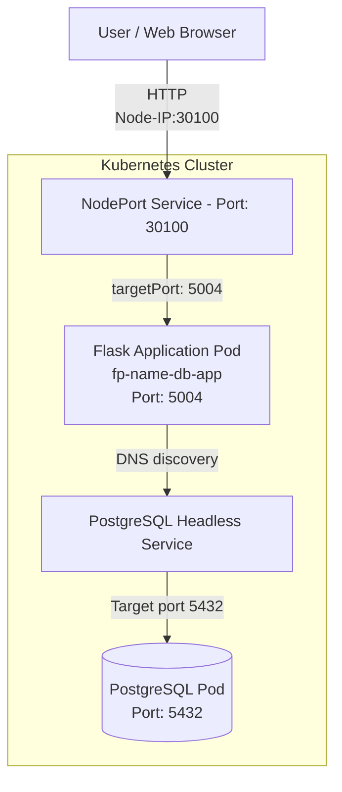

Author: Behrouz ShakeriFard  
Contact: bshakeri@torontomu.ca  
Date: November 8th, 2025

UPDATED
second iteration: July 2026

This is a sample web-based application designed for demonstrating deployment of a statefulset app on kubernetes.
Microservices: flask (front-end) + PostgreSQL (back-end)

ARCHITECTURE:

Data is retrieved from a CSV file, and initialized via a simple init.sql script.

There are two services: 
Headless service for the PostgreSQL stateful - port 5432, 
NodePort service for flask - port 5004.

Kubernetes manifest files: 

- flask deployment,
- flask Nodeport service,
- PV (persistent volume),
- NameSpace
- PostgreSQL statefulset,
- PostgreSQL Headless service,
- PostgreSQL PVC 
- ConfigMap and Secret, for allowing flask to access the database.

<h3> 
App info: </h3>

NameSpace: name-db-lab
 
App-name: fp-name-db-app
 
Flask port: 5004
 
NodePort service: 30100
 

PostgreSQL port: 5432
 
PostgreSQL Headless Service Name: name-postgres-service
 

The connection via Flask and the DB needs ConfigMap and Secret objects.

